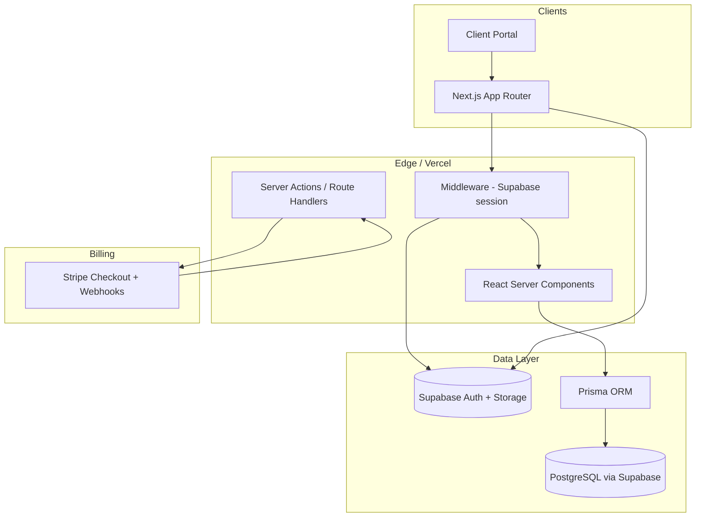

# Realtor Host — System Architecture

Realtor Host is a multi-tenant SaaS CRM for real estate professionals. Each **Organization** (brokerage or team) is an isolated tenant; all business data is scoped by `organizationId`.

## High-level diagram

## Tenancy model

| Layer | Responsibility |
|-------|----------------|
| **Supabase Auth** | Identity (JWT), OAuth, magic links, session cookies |
| **Prisma / Postgres** | Users, orgs, memberships, all CRM entities |
| **Application** | Resolves `organizationId` from session + membership; enforces RBAC |
| **RLS (Supabase)** | Defense-in-depth on any tables exposed via Supabase Data API |

**Rule:** Every query in server code includes `where: { organizationId }` derived from the authenticated user's active membership—not from client input alone.

## Authentication flow

1. User signs in via Supabase (email/password or OAuth).
2. `middleware.ts` refreshes the session on each request.
3. `auth/callback` exchanges the OAuth code for a session.
4. On first login, `ensureUserProfile()` creates `User`, default `Organization`, `Membership` (OWNER), `Subscription` (TRIALING), and default `DealStage` pipeline.

## Authorization (RBAC)

| Role | Typical permissions |
|------|---------------------|
| **OWNER** | Billing, delete org, all CRM |
| **ADMIN** | Team, settings, all CRM |
| **MANAGER** | Team leads, reports, CRM |
| **AGENT** | Own leads/deals/tasks |
| **VIEWER** | Read-only dashboard |
| **CLIENT** | Client portal only |

Permissions are checked in `src/lib/auth/permissions.ts` and used by Server Components / Actions.

## Stripe subscriptions

- Checkout Session → `stripeCustomerId` on Organization
- Webhook handler updates `Subscription` (plan, status, period end)
- Seat limits enforced via `seatLimit` vs active memberships

## Storage

- Property images and documents → Supabase Storage buckets with path prefix `{organizationId}/`
- Signed URLs for client portal downloads

## Deployment target

- **Frontend:** Vercel (Next.js 15)
- **Database:** Supabase Postgres
- **Auth / Storage:** Supabase
- **Payments:** Stripe

## Security checklist

- RLS enabled on all public-schema tables used with Supabase client
- Never use `user_metadata` for authorization in RLS
- Service role key only in server environment
- Validate `organizationId` server-side on every mutation
